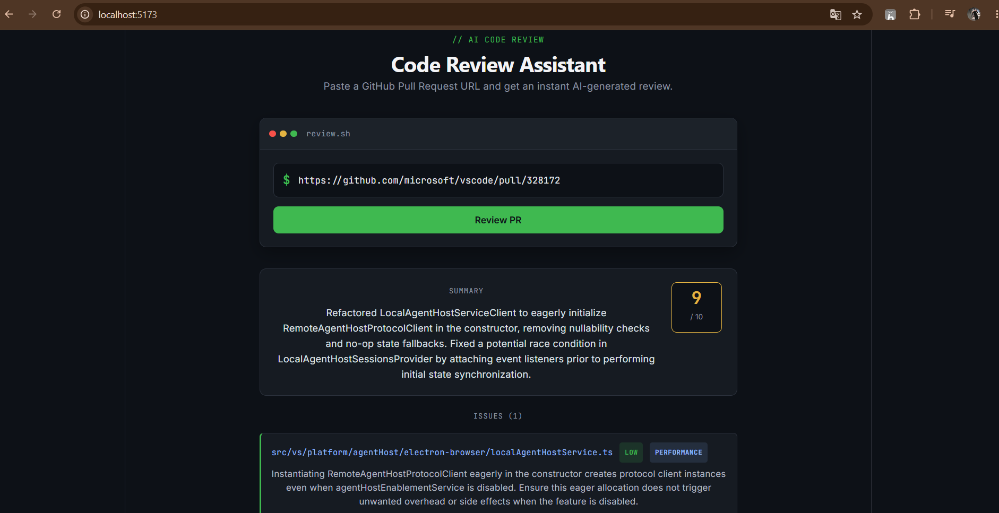

# AI Code Review Assistant

An AI-powered tool that reviews GitHub Pull Requests automatically. Paste a PR link and get a structured, AI-generated code review — summary, quality score, and specific issues flagged by file — powered by Google's Gemini API.

🔗 **[Live Demo](https://ai-code-reviewer-psi-six.vercel.app/)** | [GitHub Repo](https://github.com/Aditya-Algos/ai-code-reviewer)



## Features

- 🔗 Fetches real PR diffs directly from the GitHub API
- 🤖 Sends the diff to Google Gemini for AI-powered code review
- 📊 Returns a structured review: summary, overall quality score, and categorized issues (bug / style / security / performance)
- ⚡ Full-stack app with a FastAPI backend and React frontend
- 🎯 Clean, simple UI — just paste a PR URL and get results

## Tech Stack

**Backend:**
- Python + FastAPI
- Google Gemini API (`google-genai` SDK)
- GitHub REST API (for fetching PR diffs)

**Frontend:**
- React + Vite

## How It Works

1. User pastes a GitHub PR URL into the frontend
2. The backend parses the URL and calls the GitHub API to fetch the diff for changed files
3. The diff is sent to Gemini with a structured prompt requesting JSON output
4. Gemini returns a review: summary, issues found (with file, severity, and category), and an overall quality score
5. The frontend renders this review in a readable format

## Getting Started

### Prerequisites

- Python 3.10+
- Node.js 18+
- A free [Gemini API key](https://aistudio.google.com/) from Google AI Studio

### Backend Setup

```bash
cd backend
python -m venv venv
venv\Scripts\activate      # on Windows
# source venv/bin/activate  # on macOS/Linux

pip install fastapi uvicorn requests python-dotenv google-genai
```

Create a `.env` file inside the `backend` folder:
```
GEMINI_API_KEY=your_gemini_api_key_here
```

Run the backend:
```bash
uvicorn main:app --reload
```
Backend will be running at `http://localhost:8000`. API docs available at `http://localhost:8000/docs`.

### Frontend Setup

```bash
cd frontend
npm install
npm run dev
```
Frontend will be running at `http://localhost:5173`.

### Usage

1. Make sure both the backend and frontend are running
2. Open `http://localhost:5173` in your browser
3. Paste any public GitHub PR URL (e.g. `https://github.com/owner/repo/pull/123`)
4. Click "Review PR" and view the AI-generated review

## Project Structure

```
ai-code-reviewer/
├── backend/
│   ├── main.py          # FastAPI app: GitHub fetch + Gemini integration
│   └── .env              # API keys (not committed)
├── frontend/
│   ├── src/
│   │   ├── App.jsx       # Main UI component
│   │   └── App.css
│   └── ...
└── README.md
```

## Future Improvements

- Support for larger PRs (currently limited to first 5 changed files per review)
- Review history stored in a database (PostgreSQL)
- GitHub OAuth for reviewing private repositories
- Inline diff viewer with AI comments overlaid directly on changed lines

## License

MIT
